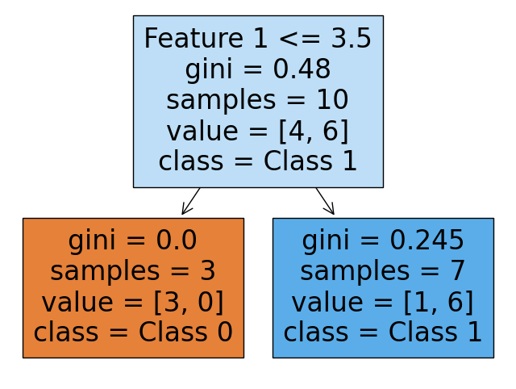

# 機械学習 - 分類 -決定木

## 決定木

* 木構造でデータを予測するアルゴリズム
* データの不純度（ジニ係数など）について着目して分岐構造を作る
* 決定木のモデルは「木」の形式で表されるため人間が直感的に理解しやすい

### ジニ係数（ジニ不純度）

* ジニ係数（厳密にはジニ不純度）は、決定木のノード分割の品質を評価する指標
* クラスが完全に混ざっている場合に最大となる
* クラスが完全に分離されている場合に最小（0）となる

$$
I_g(p)=1 - \sum_{i=1}^J p_i^2
$$

#### 計算例 ※先頭のノードの場合

$$
1-((\frac{37}{112})^2 + (\frac{34}{112})^2 + (\frac{41}{112})^2) = 0.665
$$

### サンプルコード

```py
from sklearn.datasets import load_iris
from sklearn.model_selection import train_test_split
from sklearn.tree import DecisionTreeClassifier

iris = load_iris()
x_train, x_test, y_train, y_test = train_test_split(iris.data, iris.target, random_state=0)

model = DecisionTreeClassifier(max_depth=2)
model.fit(x_train, y_train)
model.score(x_test, y_test)

from sklearn.tree import plot_tree
import matplotlib.pyplot as plt
plt.figure(figsize=(10, 10))
plot_tree(model, filled=True, feature_names=iris.feature_names, class_names=iris.target_names)
plt.show()
```

### 実行結果


## シンプルな決定木

```py
from sklearn.tree import DecisionTreeClassifier
from sklearn import tree
import matplotlib.pyplot as plt

# 特徴量が1つの小さなデータセットを作成
X = [[1], [2], [3], [4], [5], [6], [7], [8], [9], [10]]
y = [0, 0, 0, 1, 1, 0, 1, 1, 1, 1]  # クラスラベル

# 決定木モデルを作成（深さを1に制限）
model = DecisionTreeClassifier(max_depth=1, random_state=42)
model.fit(X, y)

# 決定木を可視化
plt.figure(figsize=(10, 10))
tree.plot_tree(model, feature_names=['Feature 1'], class_names=['Class 0', 'Class 1'], filled=True)
plt.show()

# 簡単な予測
predictions = model.predict(X)
print("Predictions:", predictions)
print("Actual labels:", y)
```

### 実行結果



### 考察

* 決定木はどのように `しきい値：3.5` を見つけたのか
  * 各特徴量に対して
    * すべてのユニークな値を順に並べる
    * 隣り合う値の中間点を候補のしきい値としてリストアップする
  * たとえば、ある特徴量に値「1, 2, 3, 4, 5」が含まれている場合
    * 可能な分割点の候補は「1.5, 2.5, 3.5, 4.5」となる
    * 今回のケースの場合、以下のようになる
    * 1.5, 2.5, 3.5, 4.5, 5.5, 6.5, 7.5, 8.5, 9.5

* しきい値：3.5でわけると2つのノードに分割される
  * 以下の2つのノードのジニ係数が算出できる
    * 左のノード
      * ジニ係数：0.0
        *`1 - ((3/3)**2 + (0/3)**2)`
        * 図の`value=[3, 0]`　から計算できる
    * 右のノード
      * ジニ係数：0.245
        * `1 - ((1/7)**2 + (6/7)**2)`
    * これらの2つをジニ係数を合計するのではなく[加重平均]をとる
      * 左のノード
        * gini：0.0
        * 要素数：3件
        * 重み：3/10
      * 右のノード
        * gini：0.245
        * 要素数：7件
        * 重み：7/10
      * ジニ係数の加重平均
        * 3/10 *0.0 + 7/10* 0.245 = 0.1715

* 仮に5.5で分けた場合
  * 左のノード
    * gini：0.444
      * `1 - ((4/6)**2 + (2/6)**2)`
    * 要素数：6
    * 6/10
  * 右のノード
    * gini：0.0
      * 1 - ((0/4)**2 + (4/4)**2)
    * 要素数：4件
    * 重み：4/10
  * ジニ係数の加重平均
    * 6/10 *0.444 + 4/10* 0.0= 0.2664

> この場合、しきい値：3.5のジニ係数の加重平均0.1715は、しきい値5.5の加重平均：0.2644より小さい。よってしきい値：3.5を使う

* 参考：先頭のノード
  * ジニ係数: 0.48
    * `1 - ((4/10)**2 + (6/10)**2)`
