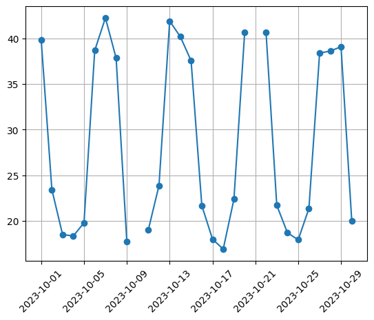

# データの取り扱い - データの線形補間

## データの準備

* 以下のsales.csvファイルを準備します。

```csv
Date,Sales
2023-10-01,39.86
2023-10-02,23.43
2023-10-03,18.51
2023-10-04,18.35
2023-10-05,19.8
2023-10-06,38.67
2023-10-07,42.25
2023-10-08,37.84
2023-10-09,17.71
2023-10-10,
2023-10-11,19.0
2023-10-12,23.86
2023-10-13,41.9
2023-10-14,40.18
2023-10-15,37.55
2023-10-16,21.69
2023-10-17,18.0
2023-10-18,16.91
2023-10-19,22.38
2023-10-20,40.63
2023-10-21,
2023-10-22,40.64
2023-10-23,21.71
2023-10-24,18.7
2023-10-25,17.93
2023-10-26,21.36
2023-10-27,38.39
2023-10-28,38.62
2023-10-29,39.09
2023-10-30,20.03
```

> 2023-10-10、2023-10-21のSalesが欠損しています。

## 折れ線グラフの表示

```py
import matplotlib.pyplot as plt

data = pd.read_csv("sales.csv")
data['Date'] = pd.to_datetime(data['Date'])

plt.plot(data['Date'], data['Sales'], marker='o')
plt.grid(True)
plt.xticks(rotation=45)
plt.show()
```



> グラフからもデータが欠損しているのがわかります。

---

## 折れ線グラフの表示 - 欠損値の補完

* pandasの `interpolate` メソッドで欠損値を補完できる
* `interpolate` メソッドはデフォルトで線形補間をサポートする
* 線形補間とは時系列データの前後の値からデータを補完する（前後の点を直線で結ぶ）

```py
import matplotlib.pyplot as plt

data = pd.read_csv("sales.csv")
data['Date'] = pd.to_datetime(data['Date'])
data["Sales"] = data["Sales"].interpolate()

plt.plot(data['Date'], data['Sales'], marker='o')
plt.grid(True)
plt.xticks(rotation=45)
plt.show()
```


