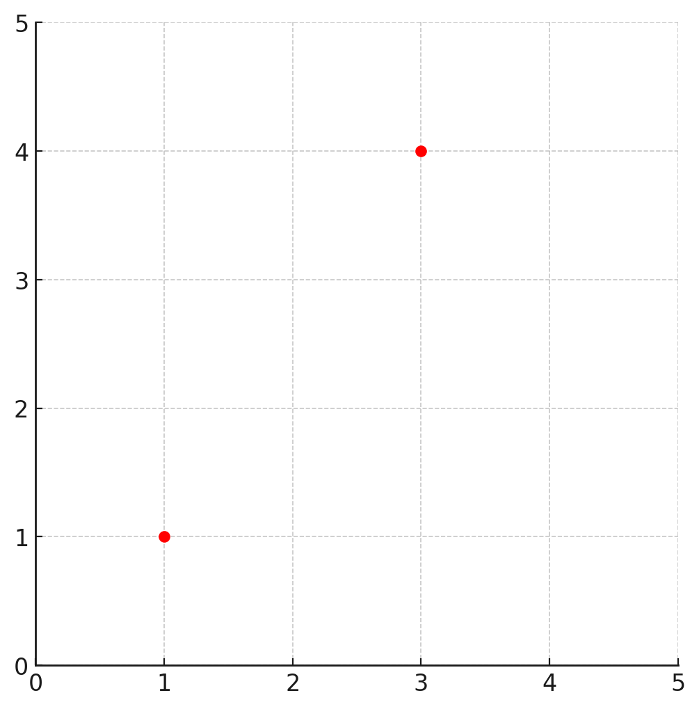
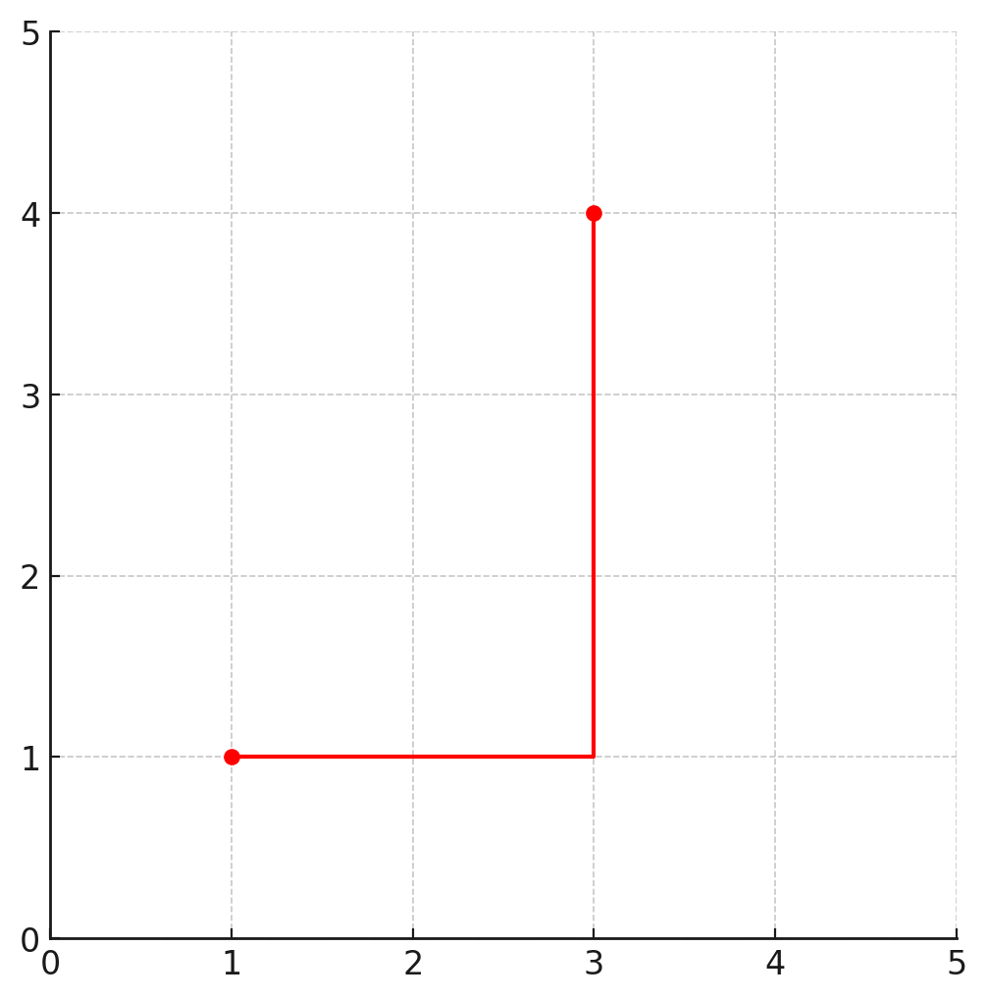
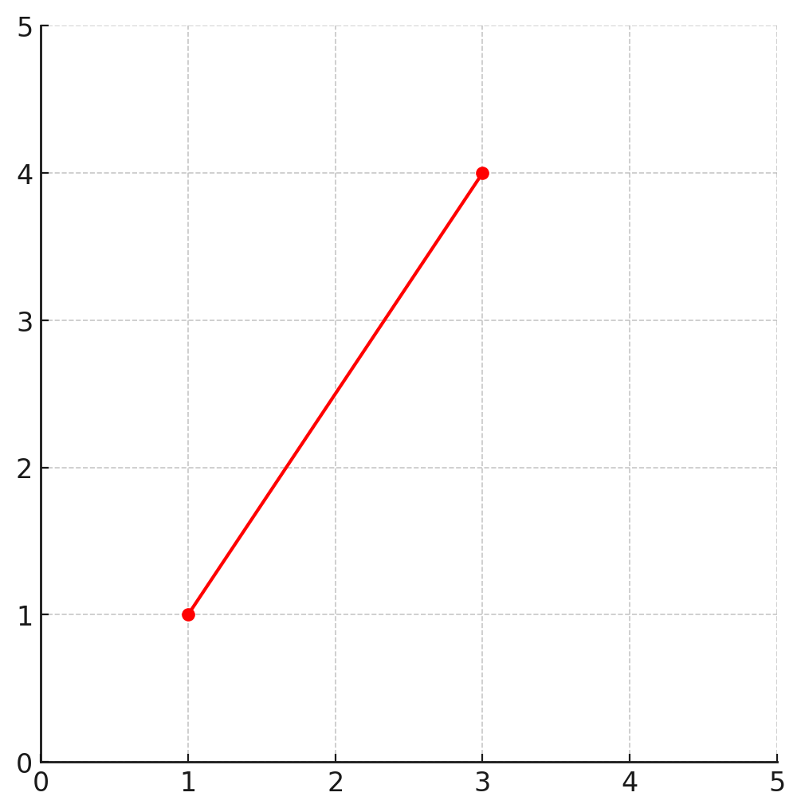
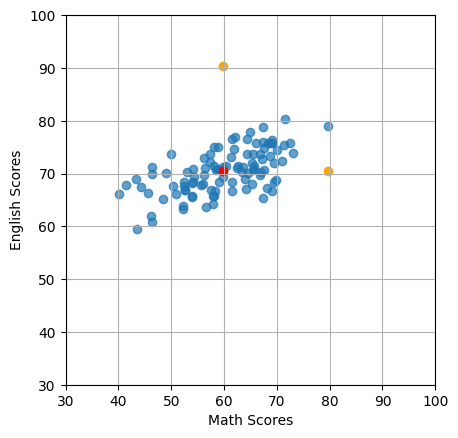

# データの取り扱い - データの距離



## マンハッタン距離とユークリッド距離

### マンハッタン距離（L1ノルム）

* グリッド上での二点間の最短距離を、水平または垂直にのみ移動することで測定する
* 距離は軸に沿った移動の合計として計算される
* 実世界の都市やビルの内部など、直角に移動する状況で使用される



> 図のマンハッタン距離は 2 + 3 = 5 となります。

### ユークリッド距離（L2ノルム）

  + 二点間の"直線"距離（通常の幾何学的な意味での距離）
  + 座標間の差の平方和の平方根として計算される
  + 通常の空間や自然な環境での距離測定に適している



> 図のマンハッタン距離は (2^2 + 3^2)^0.5 = 3.60.. となります。

---

### 参考：ミンコフスキー距離

* マンハッタン距離、ユークリッド距離の概念を一般化したもの

$$
d(x, y)=(\sum_{i=1}^n (∣x_i - y_i|^p)^{\frac{1}{p}}
$$

---

### 参考：マハラノビス距離

* 点間の距離をデータセットの分散を考慮して測定する
* データの相関構造を考慮し、異なるスケールの変数間の不均衡を調整する
* データのクラスタリングや異常値検出などに使われる



$$
D_M(\mathbf{x}, \mathbf{y})=\sqrt{(\mathbf{x}−\mathbf{y})^T S^{-1}(\mathbf{x}-\mathbf{y})} 
$$

> S^{-1} は分散共分散行列の逆行列です

<!-- 

#### サンプルコード

```py
from sklearn.covariance import MinCovDet

mcd = MinCovDet(support_fraction=1)
mcd.fit(score_df)

distance = mcd.mahalanobis(score_df)
distance
```

-->
