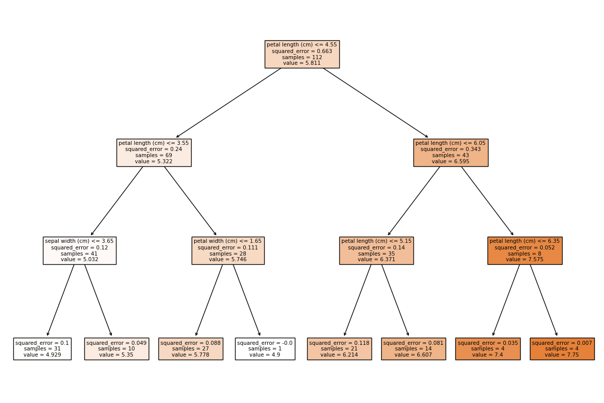

# 機械学習アルゴリズム - 決定木による回帰（回帰木）
* 決定木モデルは分類問題だけでなく回帰問題にも応用できる
* 分類問題を解く決定木を分類木、回帰を解く決定木を回帰木と呼ぶ
* 回帰木では、リーフノードの数値（通常は平均値など）を出力する



> 回帰問題では、分類問題で使われるジニ不純度の代わりに、平均二乗誤差（MSE）や平均絶対誤差（MAE）などが損失関数として用いられます。具体的には、ノード内のすべてのサンプルの目標値と予測値から計算します。

---

## サンプルコード

```py
from sklearn.datasets import load_iris
from sklearn.model_selection import train_test_split
from sklearn.tree import DecisionTreeRegressor
import pandas as pd

iris = load_iris()
iris_data = pd.DataFrame(iris.data, columns=iris.feature_names)
target = iris_data["sepal length (cm)"]
data = iris_data[["sepal width (cm)",	"petal length (cm)",	"petal width (cm)"]]

x_train, x_test, y_train, y_test = train_test_split(data, target)

model = DecisionTreeRegressor(max_depth=3)
model.fit(x_train, y_train)
print("score:", model.score(x_test, y_test))
print("feature_importances:",  model.feature_importances_)
```

### 実行結果

```
score: 0.7938269726144571
feature_importances: [0.02076523 0.96772051 0.01151426]
```

---

## 参考：パラメータの重要度

```py
pd.Series(model.feature_importances_, index=["sepal width (cm)",	"petal length (cm)",	"petal width (cm)"])
```

### 実行結果

```
sepal width (cm)     0.020765
petal length (cm)    0.967721
petal width (cm)     0.011514
dtype: float64
```

---

## 参考：決定木の可視化

```py
import matplotlib.pyplot as plt
from sklearn.tree import plot_tree

plt.figure(figsize=(15, 10))
plot_tree(model, feature_names=["sepal width (cm)",	"petal length (cm)",	"petal width (cm)"], filled=True)
plt.show()
```


