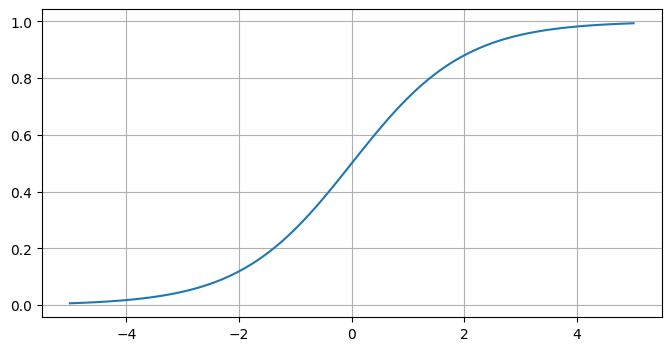

# 機械学習アルゴリズム - ロジスティック回帰
* ロジスティック回帰は分類問題に適用される教師あり学習モデル
* 線形回帰式の結果にロジスティック（シグモイド）関数を通して出力を0と1の間の確率に変換する
* 出力結果は特定のクラスに属する確率として解釈される

---

## サンプルコード

`iris` データの `setosa` と `virgicolor` の2クラスだけを抽出して、2値クラス分類に取り組む

* `setosa`と`virgicolor`の2クラスを抽出する

```py
from sklearn.datasets import load_iris
import pandas as pd

iris = load_iris()
iris_df = pd.DataFrame(iris.data, columns=iris.feature_names)
iris_df['target'] = iris.target

# filter setosa:0, virgicolor:1
filtered_iris_df = iris_df[iris_df['target'].isin([0, 1])]
filtered_iris_df
```

* `LogisticRegression` を使ってロジスティック回帰モデルを作成する

```py
from sklearn.linear_model import LogisticRegression
from sklearn.model_selection import train_test_split
from sklearn.metrics import accuracy_score

data = filtered_iris_df.drop('target', axis=1)
target = filtered_iris_df['target']
X_train, X_test, y_train, y_test = train_test_split(data, target, test_size=0.3, random_state=1)

model = LogisticRegression()
model.fit(X_train, y_train)

y_pred = model.predict(X_test)
accuracy = accuracy_score(y_test, y_pred)
print("acc:", accuracy)
```

### 実行結果

```
acc: 1.0
```

> この例では `setosa` と `virgicolor` という簡単な分類問題だったため、正答率は100%となっています。

### 参考：ロジスティック関数（シグモイド関数）

$$
f(y) = \frac{1}{1 + e^{-y}}
$$

```py
import matplotlib.pyplot as plt
import numpy as np

def sigmoid(x):
  return 1 / (1 + np.exp(-x))

x = np.linspace(-5, 5, 100)

plt.figure(figsize=(8, 4))
plt.plot(x, sigmoid(x))
plt.grid(True)
plt.show()
```



> sigmoid関数の出力結果は、0〜1の間の値になります。

#### 参考：シグモイド関数の微分

$$
f'(x) = f(x) (1-f(x))
$$
