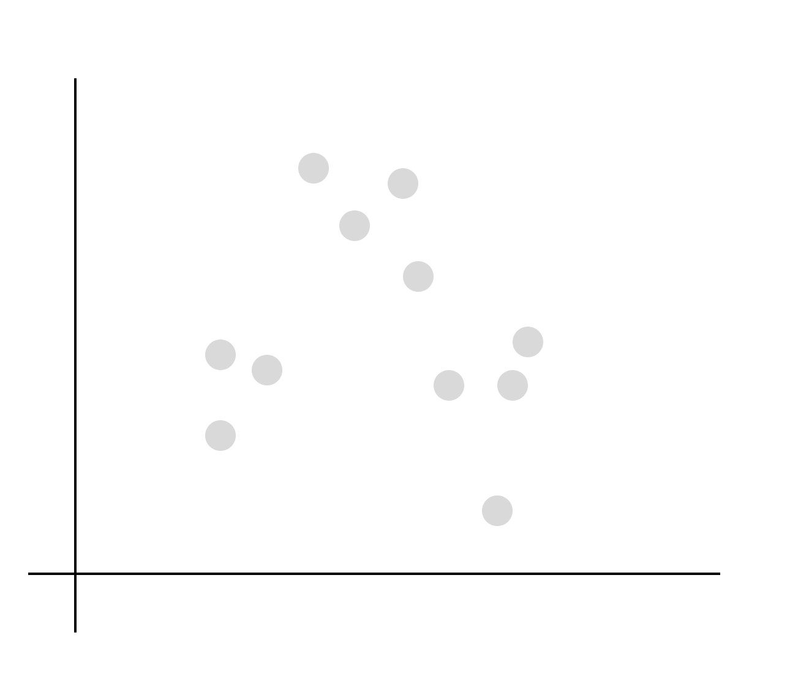
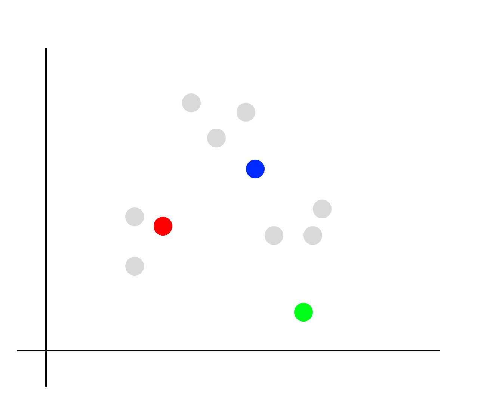
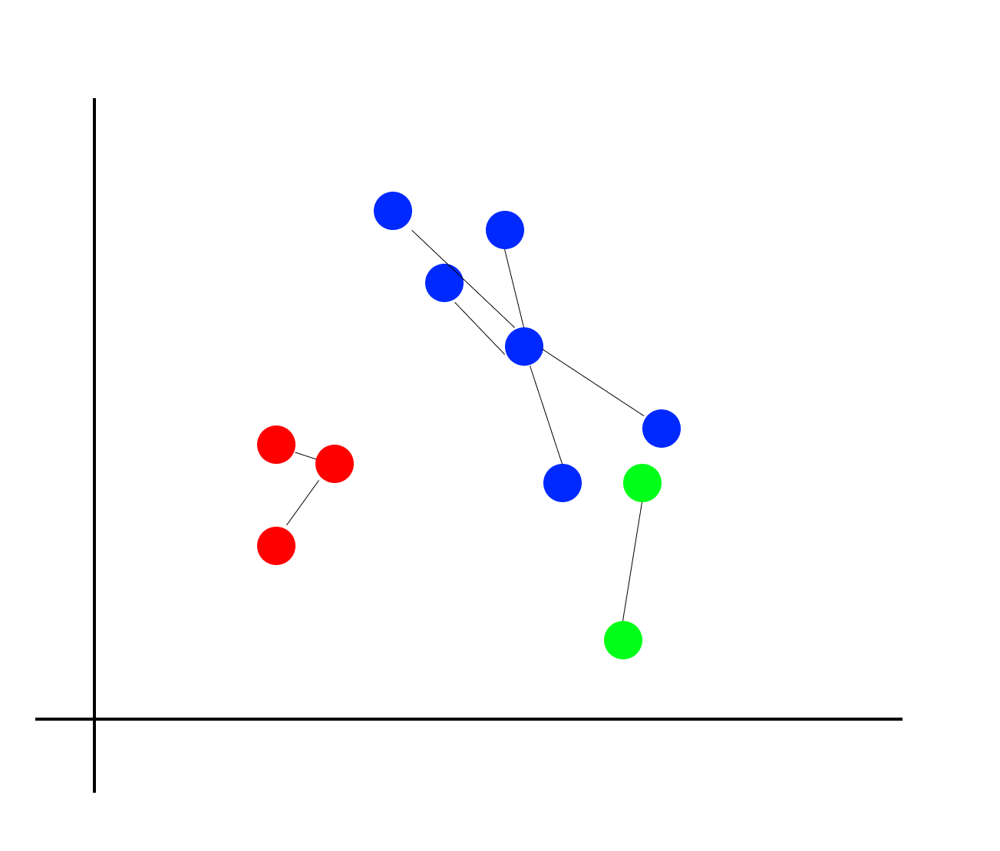
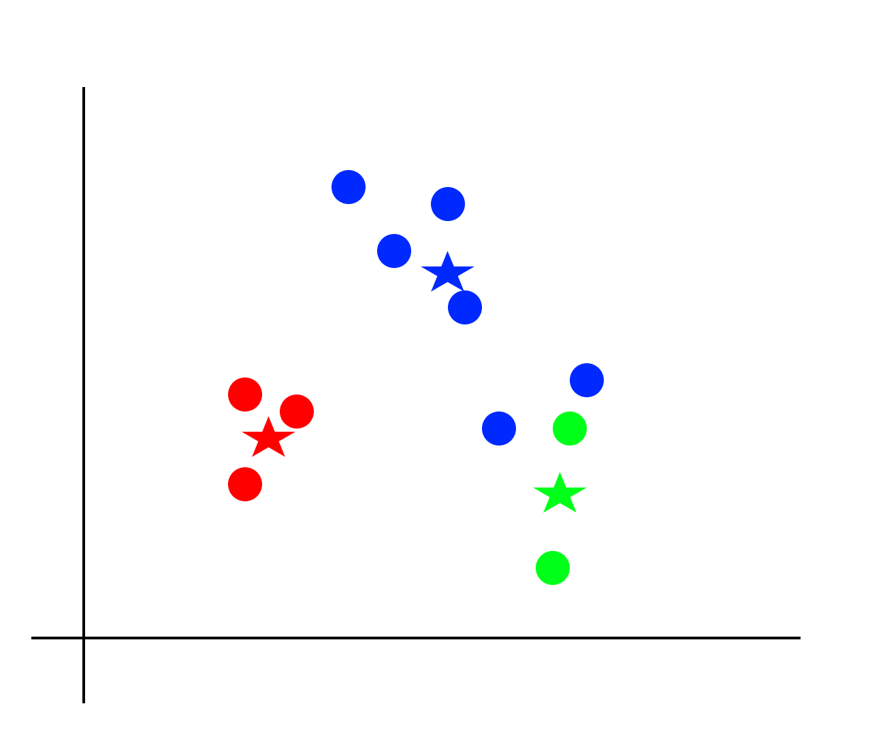
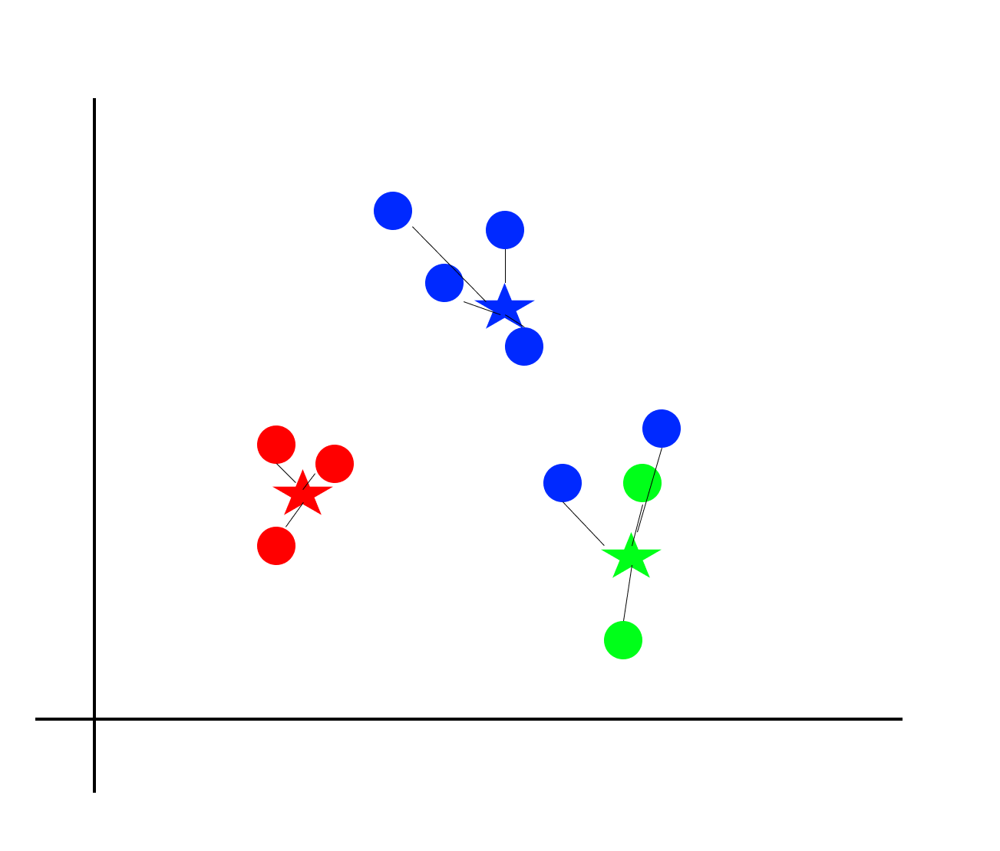
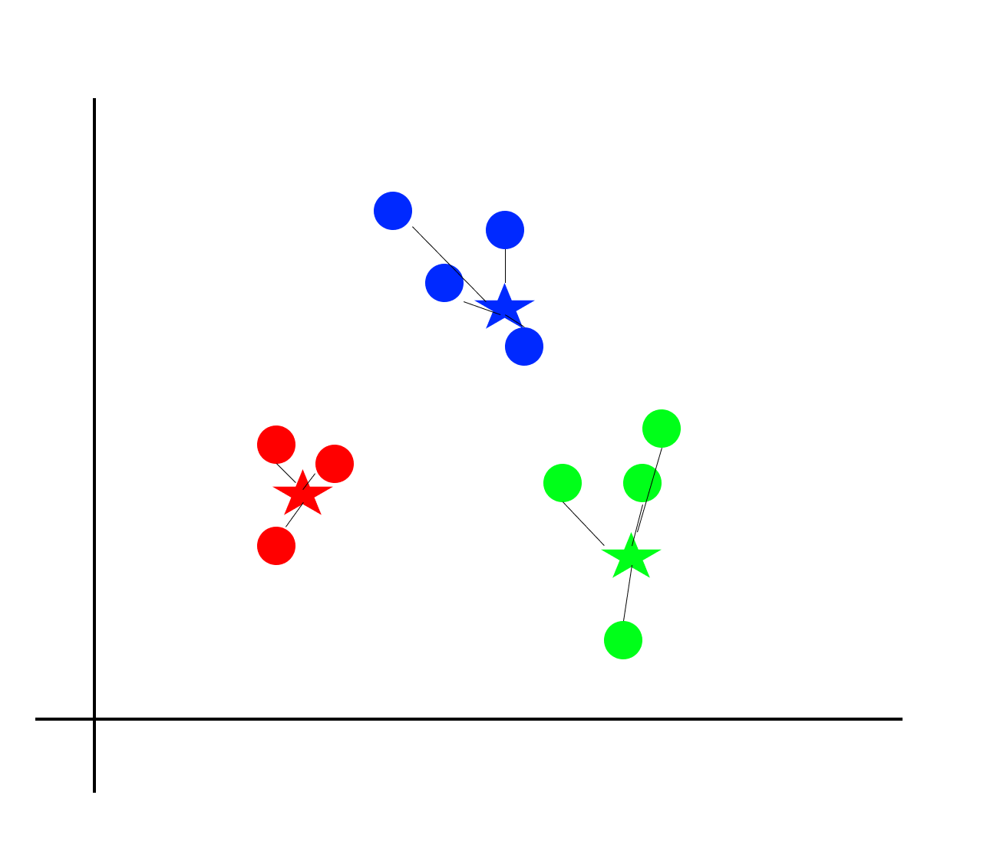
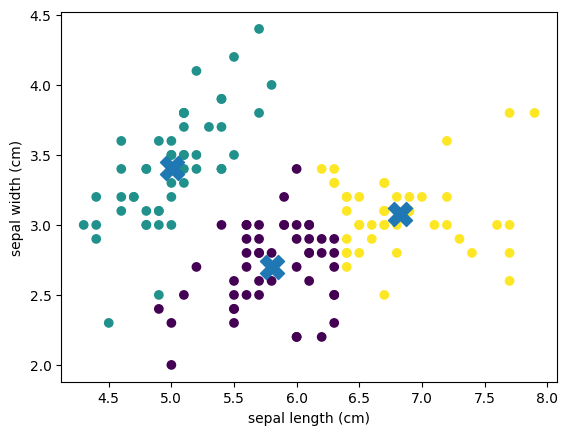

# 教師なし学習 - クラスタリング
* データを類似性に基づいてグループ（クラスター）に分類する教師なし学習の手法
* データセット内のパターンや構造を発見するのに使用される
* 主要なクラスタリング手法にはk-means、階層的クラスタリングなどがある

## k-Means

* k-Means法は非階層型クラスタリングアルゴリズムの一つ
* 教師なし学習の手法で、データを指定されたk個のクラスタに分ける
* k個のデータポイントをクラスタ中心として選択し、それを基にデータのグループ化する

> クラスタ（Cluster）とは集団を意味する言葉です。クラスタリングは教師データを使わずに、データの傾向を分析して、データにラベル付けします。

### k-Meansの手順

* クラスター数を決める（ここでは3つに分けるものとします）



* 指定したクラスター数分、ランダムにデータを選ぶ（クラスター中心とする）



* クラスター中心に各データを紐付ける



* 作成できたクラスターから、クラスター中心を計算する



* 新たなクラスター中心に各データを紐付ける



* 所属するクラスターが更新される



---

## サンプルコード

```py
import numpy as np
import pandas as pd
from sklearn.datasets import load_iris
from sklearn.cluster import KMeans
import matplotlib.pyplot as plt

iris = load_iris()
df = pd.DataFrame(iris.data,
                  columns=iris.feature_names)
df = df.loc[:, :"sepal width (cm)"]

model = KMeans(n_clusters=3, n_init="auto")
model.fit(df)

labels = model.labels_
# print(labels)

plt.scatter(df["sepal length (cm)"], df["sepal width (cm)"], c=labels)
plt.xlabel(iris.feature_names[0])
plt.ylabel(iris.feature_names[1])
plt.scatter(model.cluster_centers_[:, 0], model.cluster_centers_[:, 1], s=300, marker='X')
plt.show()
```

## 実行結果


