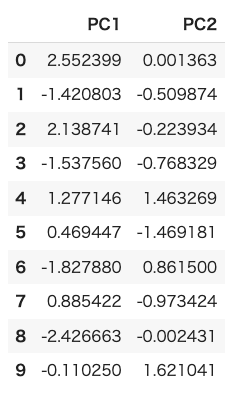
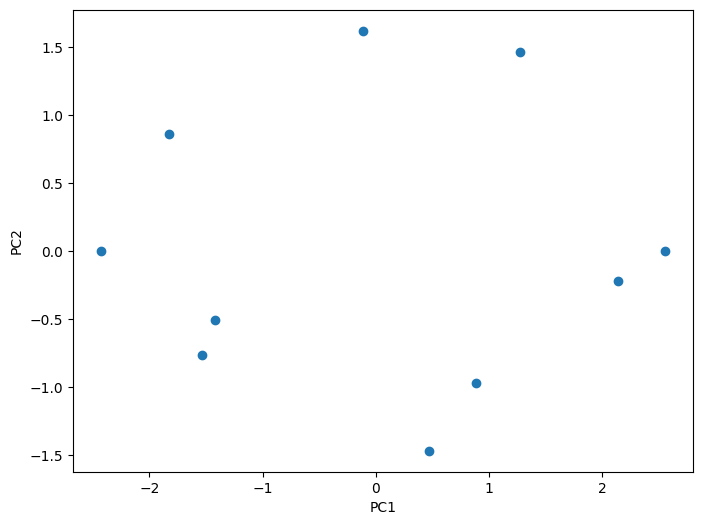

# 教師なし学習 - 次元削減
* 次元削減とはデータの特徴量を減らすプロセスのこと
* 高次元データを低次元で表現することで、データの構造やパターンを明確にする
* 代表的な手法に主成分分析（PCA: Principal Component Analysis）がある
  

> また機械学習に使うデータの特徴量を減らすことで、モデルの計算負荷を減らしたり、過学習の可能性を減らしたりといった効果も期待できる

## 主成分分析（PCA）

* 教師なし学習における次元削減の手法の一つ
* データの分散が最大になるように、元の特徴空間を新しい次元に変換する
* 主要な成分のみを保持することで、データの圧縮と効率的な情報表現を実現する

### （参考）主成分分析の計算過程

1. 主成分分析では、標準化したデータから分散共分散行列を作成する
2. 分散共分散行列から固有値および、固有ベクトルを計算する
3. 固有値の大きなものから第1主成分、第2主成分と解釈する
4. 標準化された各データと、固有ベクトルと線形結合することで、第1主成分データ（主成分得点）に変換する
5. 固有値から寄与率を計算する

#### （参考）用語の説明

* 標準化
  + データセット内の各特徴量の平均を0、標準偏差を1に調整するプロセス
  + 異なるスケールの特徴量を比較可能となる
* 分散共分散行列
  + データセット内の全ての特徴量間の分散と共分散の関係を示す行列
  + 特徴量間の線形関係の強さと方向を表す
* 固有値
  + 分散共分散行列から導出されるスカラー値
  + その行列によって引き起こされるベクトルのスケーリング量を示す
  + データの分散に対する主成分の寄与度を表す
* 固有ベクトル
  + 分散共分散行列が作用するとき、その方向が変わらないベクトル
  + データセットの主要な方向（主成分）を示す
* 線形結合
  + 複数のベクトルにスカラー倍をしてその和を取ることにより新しいベクトルを生成する数学的操作
  + 元のデータセットの特徴量を固有ベクトルの線形結合によって主成分得点に変換する
* 主成分得点
  + 元のデータセットを、その主成分（固有ベクトルに基づく新しい軸）に投影した結果得られる値
  + データは主成分によって定義される新しい空間に位置づけられる
* 寄与率
  + 固有値を全固有値の合計で割ることによって得られる比率
  + 主成分がデータセットの全分散に対してどれだけ貢献しているかを示す
  + 各主成分の相対的な重要性が定量化される

---

## サンプルデータ

* scores.csv
  + 国語、社会、数学、理科のテスト結果

```csv
Japanese,Social,Math,Science
80,83,52,41
53,67,82,81
73,89,46,57
64,56,78,89
59,69,44,47
71,86,75,73
49,46,79,69
79,75,69,64
45,55,89,82
50,58,51,59
```

---

## サンプルコード

* PCAによる次元削減

```py
import pandas as pd
from sklearn.decomposition import PCA
from sklearn.preprocessing import StandardScaler

scores_df = pd.read_csv("scores.csv")
scaler = StandardScaler()
scores_df_scaled = scaler.fit_transform(scores_df)

model = PCA(n_components = 2)
pca_result = model.fit_transform(scores_df_scaled)

pca_result_df = pd.DataFrame(data = pca_result, columns = ['PC1', 'PC2'])
pca_result_df
```



* 固有値の確認

```py
model.explained_variance_ # array([3.03879688, 1.05751264])
```

* 固有ベクトルの確認

```py
model.components_
# array([[ 0.47894637,  0.50412676, -0.50701295, -0.50931764],
#        [-0.54855318, -0.46722432, -0.49550564, -0.48504124]]) 
```

* 寄与率の確認

```py
model.explained_variance_ratio_ # rray([0.6837293 , 0.23794034])
```

* 第1主成分、第2主成分の可視化

```py
import matplotlib.pyplot as plt

plt.scatter(pca_result_df['PC1'], pca_result_df['PC2'])
plt.xlabel('PC1')
plt.ylabel('PC2')
plt.show()
```

## 実行結果



---

### 参考

1. 主成分分析では、標準化したデータから分散共分散行列を作成する

```py
import pandas as pd
from sklearn.preprocessing import StandardScaler

scores_df = pd.read_csv("scores.csv")
scaler = StandardScaler()
scores_df_scaled = scaler.fit_transform(scores_df)

scores_df_scaled_cov = pd.DataFrame(scores_df_scaled).cov()
scores_df_scaled_cov
```

2. 分散共分散行列から固有値および、固有ベクトルを計算する

```py
import numpy as np

eig = np.linalg.eig(scores_df_scaled_cov)
print("eigen values:", eig.eigenvalues)
print("eigen vectors:", eig.eigenvectors)
```

3. 固有値の大きなものから第1主成分、第2主成分と解釈する

```
eigen values: [3.03879688 1.05751264 0.21308672 0.1350482 ]
eigen vectors: [[ 0.47894637  0.54855318 -0.64428238  0.23366642]
 [ 0.50412676  0.46722432  0.68596209 -0.23877532]
 [-0.50701295  0.49550564 -0.20027779 -0.67624022]
 [-0.50931764  0.48504124  0.27247941  0.65657103]]
```

> 第1主成分の固有値は3.03879688 、第2主成分の固有値は1.05751264と解釈できます。

> 第1主成分の固有ベクトルは先頭列の値を参照するので、[0.47894637, 0.50412676, -0.50701295, -0.50931764]です。第2主成分の固有ベクトルも同様に2列目を参照すると[0.54855318, 0.46722432, 0.49550564, 0.48504124]となります。

4. 標準化された各データと、固有ベクトルと線形結合することで、第1主成分データ（主成分得点）に変換する

```py
np.dot(scores_df_scaled, eig.eigenvectors)
```

#### 実行結果

```
array([[ 2.55239921e+00, -1.36259803e-03, -4.88522121e-01, -4.11283712e-01],
       [-1.42080311e+00,  5.09873953e-01,  4.94524899e-01, -1.60010198e-01],
       [ 2.13874101e+00,  2.23933817e-01,  5.45157905e-01, 3.20022897e-01],
       [-1.53755951e+00,  7.68328676e-01, -4.26297510e-01, 7.64435423e-01],
       [ 1.27714576e+00, -1.46326933e+00,  1.34423797e-01, 3.87830710e-02],
       [ 4.69446969e-01,  1.46918116e+00,  4.28858603e-01, -1.98938962e-01],
       [-1.82787991e+00, -8.61499938e-01, -5.13950668e-01, -2.79874183e-01],
       [ 8.85422259e-01,  9.73423561e-01, -6.22477853e-01, -4.88521120e-04],
       [-2.42666274e+00,  2.43147320e-03,  2.52005909e-01, -3.61784698e-01],
       [-1.10249931e-01, -1.62104078e+00,  1.96277037e-01, 2.89138882e-01]])
```

5. 固有値から寄与率を計算する

```py
print("contribution ratio1:", eig.eigenvalues[0] / eig.eigenvalues.sum())
print("contribution ratio2:", eig.eigenvalues[1] / eig.eigenvalues.sum())
```

#### 実行結果

```py
contribution ratio1: 0.6837292984043808
contribution ratio2: 0.2379403429381061
```

> 第1主成分の寄与率と第2主成分の寄与率を加算すると 0.9216696413424869 となります。この結果、元のデータの約92％の情報を維持できていることがわかります。
